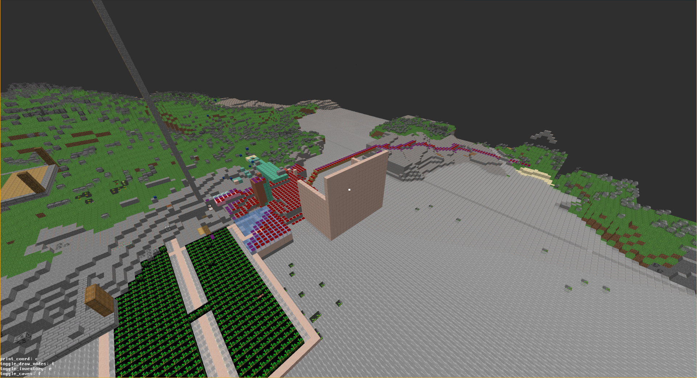

# A Minecraft Bot written in zig
Linux only because of epoll() usage, can easily be changed

[Lua API documentation](lua_doc.md)

## Running:
        # Install zig version 0.13.0
        # make sure you have the following libraries installed system-wide:
        # libepoxy
        # sdl2
        # freetype
        # 
        # Setup a 1.19.4 Minecraft server and ensure the following is set in server.properties:
        # online-mode=false

        git clone https://github.com/nmalthouse/mcbot.git
        cd mcbot
        git submodule update --init --recursive
        zig build run

The file bot_config.lua sets port, ip, and bots that will be added.

## Current features:
- Code generation for the Minecraft protocol.
- Dimensions
- Pathfinding, (includes: ladders, gaps)
- Debug rendering
- Block breaking
- Basic inventory interaction
- Crafting
- Multiple bots
- Lua scripting

A picture of the debug renderer and astar pathfinding nodes. 

# Depends on
* [zig-nbt](https://github.com/SuperAuguste/zig-nbt)
* Everything listed under ratgraph's dependencies

## Architecture overview:

        fn main
            reads bot_config.lua
            Establishes connections with Minecraft server for all bots specified.
            Sets up epoll() to monitor all the tcp file descriptors.
            Spawns the updateBots() thread.
            Respond to epoll events, parsing Minecraft packets and updating our version of the Minecraft state.
            This thread sends some packets back to the server, (keepalive, respawn, confirm teleport request).
            Optionally spawn the draw() thread.
        
        fn updateBots()
            Spawns a thread for each bot. Currently this is a thread that opens a Lua file and calls the Lua function loop().
            Runs a 20 tick per second game loop.
            Each Lua thread has an associated ActionList and mutex.
            While updateBots processes the action list the Lua thread blocks.
            once the actionlist is exhausted for a given bot, updateBots allows that bot to continue its script.
            see astar.zig PlayerActionItem for a list of actions.
        
        
        fn draw()
            Renders a basic view of the Minecraft world. Can show entities, inventory, pathfinding nodes.
            Useful for debugging pathfinder as you can see what weights need to be adjusted
            launch with zig build run -- draw

